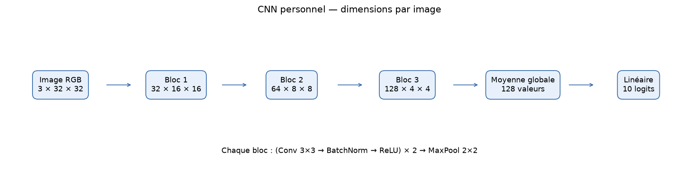
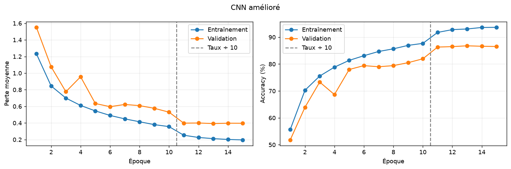
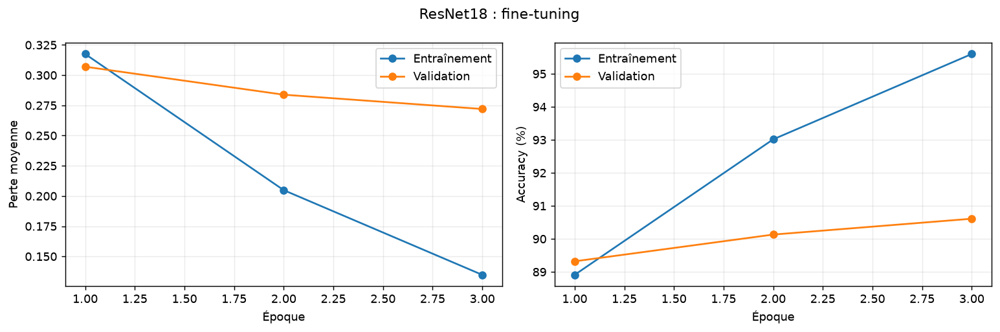
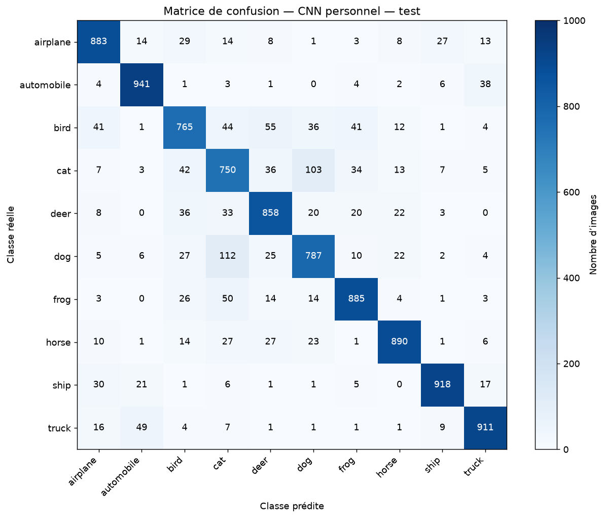
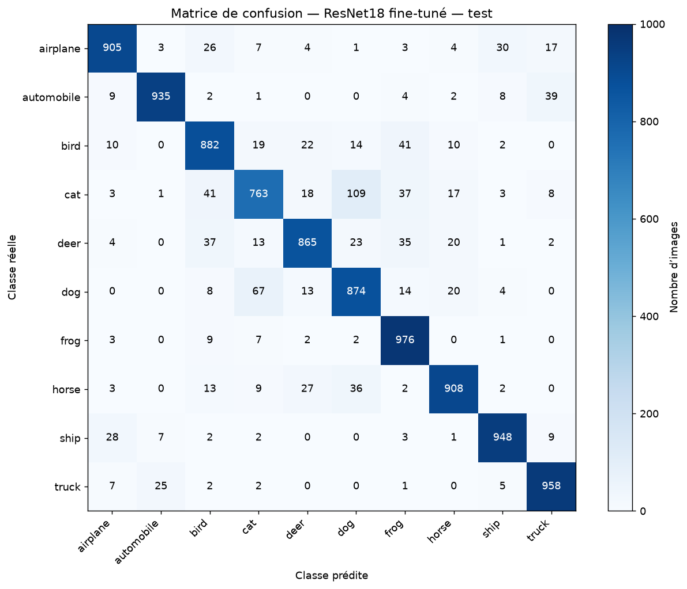
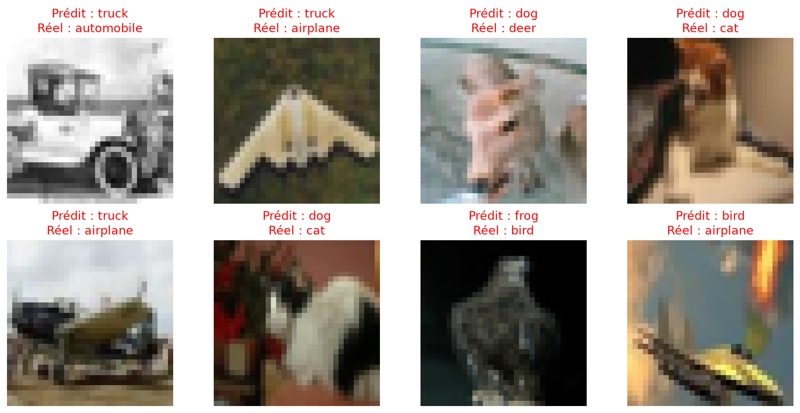

# Classification d’images sur CIFAR-10

### Du CNN personnel au fine-tuning de ResNet18 avec PyTorch

Comment construire un CNN performant, observer le surapprentissage et le comparer à un modèle préentraîné ? Ce projet répond à cette question à travers plusieurs expériences expliquées dans un notebook : convolutions, dropout, augmentation des données, BatchNorm, réduction du taux d’apprentissage et transfert d’apprentissage.

**Résultats sur les 10 000 images de test : 85,88 % pour le CNN personnel et 90,14 % pour ResNet18 fine-tuné.**

➡️ **[Ouvrir le notebook complet](notebooks/01_cnn_cifar10.ipynb)** — les tableaux et graphiques sont déjà affichés ; aucun entraînement n’est nécessaire pour les consulter.

## Résultats

Les sauvegardes sont sélectionnées selon la **perte de validation minimale**, puis évaluées sur le jeu de test officiel. Les scores et matrices ci-dessous ont été recalculés depuis les mêmes fichiers de poids, sans réentraînement.

| Modèle retenu | Accuracy validation | Accuracy test | Perte test |
|---|---:|---:|---:|
| CNN personnel — époque 13 | 86,79 % | **85,88 %** | 0,4160 |
| ResNet18 — après 3 époques de fine-tuning | 90,61 % | **90,14 %** | 0,3018 |

Le gain de ResNet18 est de **4,26 points de pourcentage**, soit **426 bonnes classifications supplémentaires** sur 10 000 images. Il bénéficie toutefois d’un préentraînement sur ImageNet, contrairement au CNN personnel entraîné depuis zéro.

Les métriques détaillées, les matrices et les empreintes SHA-256 des sauvegardes sont disponibles dans [verified_metrics.json](results/verified_metrics.json).

## Données et protocole

[CIFAR-10](https://www.cs.toronto.edu/~kriz/cifar.html) contient des images couleur de **32 × 32 pixels**, réparties entre dix classes : avion, voiture, oiseau, chat, cerf, chien, grenouille, cheval, bateau et camion.

| Ensemble | Nombre d’images | Usage |
|---|---:|---|
| Entraînement | 40 000 | Ajuster les paramètres |
| Validation | 10 000 | Comparer les expériences et sélectionner les sauvegardes |
| Test officiel | 10 000 | Évaluer les configurations retenues |

La séparation entraînement/validation utilise la graine **42**. Les mêmes indices sont réutilisés pour toutes les architectures. Les augmentations aléatoires concernent uniquement l’entraînement. Le test ne sert pas à choisir les réglages.

## Expériences

| Expérience | Configuration | Époques | Taux d’apprentissage |
|---|---|---:|---|
| Référence | Petit CNN à deux convolutions | 10 prévues¹ | 0,001 |
| Dropout | Petit CNN + dropout de 0,3 | 10 | 0,001 |
| Augmentation | Dropout + retournements horizontaux aléatoires | 10 | 0,001 |
| CNN amélioré | Six convolutions, BatchNorm et pooling moyen global | 15 | 0,001 puis 0,0001 après 10 époques |
| ResNet18 — tête | Partie préentraînée gelée, nouvelle couche finale | 5 | 0,001 |
| ResNet18 — fine-tuning | Dernier groupe de blocs `layer4` et couche finale | 3 supplémentaires | 0,00001 |

¹ L’historique conservé de la référence est incomplet et ne permet pas de vérifier une expérience de dix époques. Son score est **exclu du comparatif publié**. Son architecture et le protocole complet restent disponibles pour un nouvel entraînement.

Les petits CNN sont comparés à leur dernière époque. Le CNN amélioré et les deux phases de ResNet18 utilisent la meilleure perte de validation. Les statistiques de BatchNorm de ResNet18 restent fixes pendant l’adaptation.

### CNN personnel

Le modèle amélioré possède **288 746 paramètres**. Chaque bloc comprend deux séquences convolution → BatchNorm → ReLU, puis un max pooling. La moyenne globale réduit les 128 cartes finales à 128 caractéristiques avant la classification.



La diminution du taux d’apprentissage après dix époques améliore nettement la validation. La meilleure perte de validation est obtenue à l’époque 13.



### Transfert d’apprentissage

ResNet18 utilise les poids `IMAGENET1K_V1`. Son prétraitement redimensionne et recadre les images à **224 × 224**, puis normalise les canaux. Agrandir une image CIFAR-10 ne crée pas de nouveaux détails.

La première phase entraîne uniquement une nouvelle tête de classification de **5 130 paramètres**. La seconde adapte également `layer4`, avec un taux d’apprentissage réduit. Cette adaptation améliore la validation davantage que l’entraînement de la tête seule.



## Analyse des erreurs

Les deux matrices utilisent la même échelle. Les lignes correspondent aux classes réelles, les colonnes aux prédictions et la diagonale aux bonnes réponses. Le notebook calcule également le rappel par classe et les confusions les plus fréquentes.

| CNN personnel | ResNet18 fine-tuné |
|---|---|
|  |  |

Quelques erreurs sont affichées pour compléter les scores globaux. Ces huit premiers exemples ne constituent pas un échantillon représentatif et ne démontrent pas quels indices le réseau utilise.



## Utiliser le projet

### 1. Consulter les résultats

Le notebook peut être lu directement sur GitHub. Pour exécuter son **mode rapport** dans VS Code, installer Python et les extensions Python/Jupyter, puis ouvrir un terminal PowerShell à la racine du projet :

```powershell
py -m venv .venv
.\.venv\Scripts\python.exe -m pip install --upgrade pip
.\.venv\Scripts\python.exe -m pip install matplotlib ipython ipykernel
```

Ouvrir [le notebook](notebooks/01_cnn_cifar10.ipynb), sélectionner l’environnement `.venv` comme noyau, puis conserver :

```python
MODE = "report"
```

Exécuter les cellules dans l’ordre. Ce mode utilise les JSON et les figures inclus dans le dépôt : **aucun GPU, dataset, poids de modèle ou téléchargement n’est nécessaire après installation des dépendances**.

### 2. Réévaluer les modèles sauvegardés

L’environnement utilisé pour les scores publiés est **Python 3.14, PyTorch 2.11.0+cu128 et torchvision 0.26.0+cu128**, sur une NVIDIA GeForce RTX 2060 de 6 Go.

Pour installer les mêmes versions avec CUDA 12.8 sous Windows, dans l’environnement précédent :

```powershell
.\.venv\Scripts\python.exe -m pip install torch==2.11.0 torchvision==0.26.0 --index-url https://download.pytorch.org/whl/cu128
```

Pour une installation CPU de ces versions :

```powershell
.\.venv\Scripts\python.exe -m pip install torch==2.11.0 torchvision==0.26.0 --index-url https://download.pytorch.org/whl/cpu
```

Les instructions de plateforme et de compatibilité sont disponibles sur [le site officiel de PyTorch](https://pytorch.org/get-started/locally/). Redémarrer le noyau après installation.

Placer ensuite les fichiers suivants dans `models/` :

```text
models/
├── cnn_improved_best.pth
└── resnet18_finetuned_best.pth
```

Les poids ne sont **pas distribués dans ce dépôt**. Le mode `evaluate` nécessite ces fichiers locaux ; leur absence n’empêche pas d’utiliser le mode rapport.

Dans la configuration du notebook :

```python
MODE = "evaluate"
```

Ce mode télécharge CIFAR-10 si nécessaire, charge les sauvegardes et recalcule validation, test et matrices. Il n’ajuste aucun paramètre. Les résultats sont écrits dans un nouveau dossier `runs/` horodaté.

### 3. Réentraîner

Avec PyTorch et torchvision installés :

```python
MODE = "train"
```

Ce mode entraîne successivement les expériences, sélectionne les deux modèles finaux sur la validation, puis les évalue sur le test. Il peut télécharger CIFAR-10 et les poids ImageNet. Un GPU est recommandé ; le code prévoit un repli sur CPU, plus lent.

Chaque nouvelle exécution crée son propre dossier :

```text
runs/<date_et_heure>/
├── models/
├── results/
└── figures/
```

Les résultats publiés et les sauvegardes originales ne sont pas écrasés. Pour une expérience complète, redémarrer le noyau, choisir le mode, puis exécuter les cellules dans l’ordre. Réexécuter isolément des cellules d’entraînement peut modifier l’état du modèle et l’historique.

Une nouvelle exécution peut produire des scores différents. La graine, l’environnement, l’ordre des appels aléatoires et les opérations GPU influencent la reproductibilité. Les poids `.pth` ne contiennent pas l’état de l’optimiseur : ils permettent de charger un modèle pour l’inférence, pas de reprendre exactement tout son entraînement.

## Organisation

```text
cnn-image-classification/
├── notebooks/
│   └── 01_cnn_cifar10.ipynb        # Rapport, code et expériences
├── figures/
│   └── github_*.png               # Schéma, courbes, matrices et erreurs
├── results/
│   ├── experiment_histories.json  # Historiques vérifiables publiés
│   ├── verified_metrics.json      # Scores, matrices et empreintes des poids
│   └── notebook_verification.json # Contrôles du notebook
├── README.md
└── .gitignore
```

`data/`, `models/`, `.venv/` et `runs/` sont des dossiers locaux ignorés par Git. Les fichiers historiques et brouillons éventuellement conservés localement ne sont pas nécessaires au notebook publié.

## Vérifications effectuées

- Exécution des **18 cellules de code** en mode rapport, dans l’ordre.
- Validation du format du notebook.
- Réévaluation complète des deux sauvegardes sur validation et test.
- Vérification de la cohérence entre la diagonale des matrices et l’accuracy.
- Contrôle des fonctions d’entraînement sur un mini-lot artificiel, y compris le gel des premières couches et des statistiques BatchNorm de ResNet18.

La version nettoyée n’a pas fait l’objet d’un nouvel entraînement complet de toutes les expériences. Les contrôles ne doivent pas être interprétés comme une garantie de reproduire exactement les scores historiques.

## Bilan et limites

Ce projet met en pratique la préparation des données, les convolutions, l’optimisation par gradients, la régularisation, la sélection sur validation, le transfert d’apprentissage et l’analyse des erreurs.

- Une exécution par configuration est présentée, sans moyenne ni dispersion entre graines.
- Plusieurs composants changent ensemble dans le CNN amélioré : leurs effets individuels ne sont pas isolés.
- ResNet18 bénéficie d’ImageNet ; les données, résolutions et budgets de calcul ne sont pas équivalents.
- L’ancien historique incomplet du CNN de référence ne permet pas de chiffrer un gain fiable face à cette expérience.
- Le test a été réévalué pour vérifier les sauvegardes et les figures, sans nouveau réglage fondé sur ces résultats.
- Les performances sur CIFAR-10 ne garantissent pas les mêmes résultats sur des photos personnelles.

## Références

- [CIFAR-10 — Alex Krizhevsky](https://www.cs.toronto.edu/~kriz/cifar.html)
- [Documentation PyTorch](https://docs.pytorch.org/docs/stable/index.html)
- [ResNet18 — torchvision](https://docs.pytorch.org/vision/stable/models/generated/torchvision.models.resnet18.html)
- [He et al. — Deep Residual Learning for Image Recognition](https://arxiv.org/abs/1512.03385)
